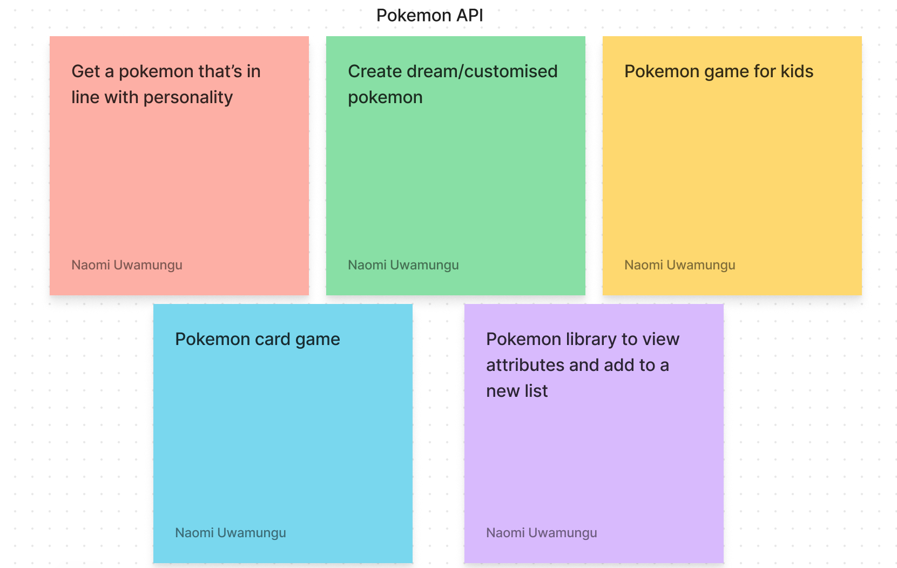
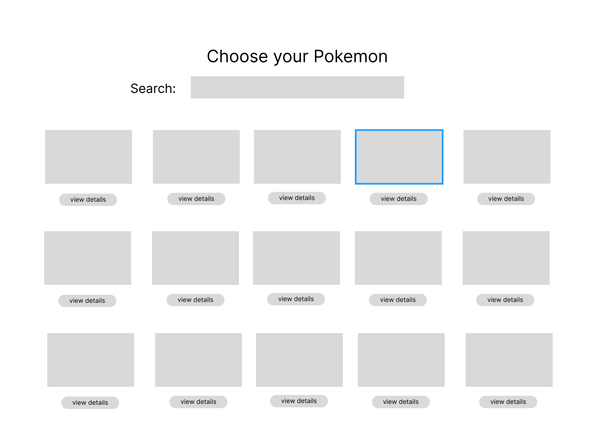
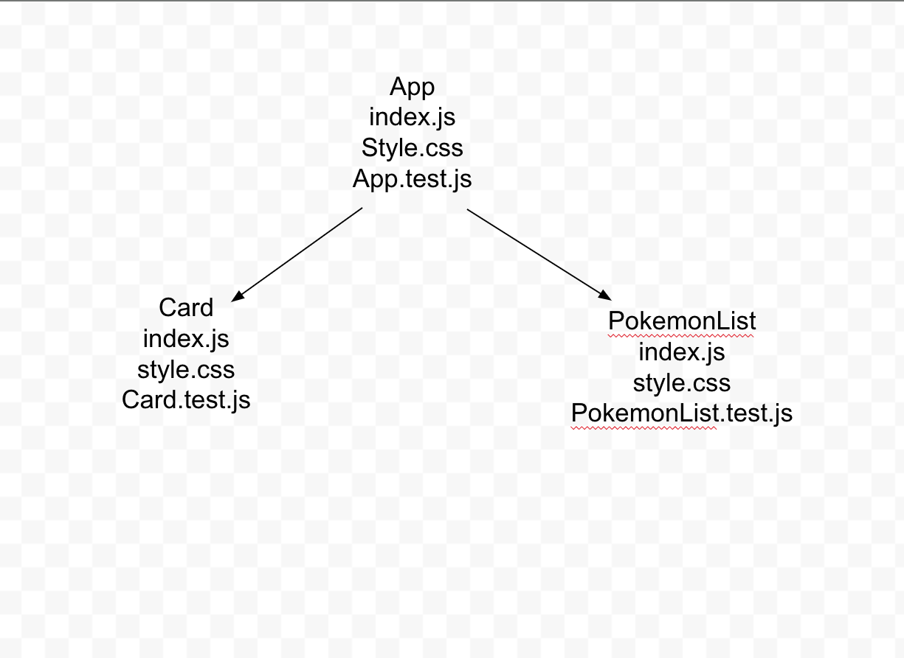

# React-athon

## Brainstorming:



## Low fidelity wireframe



## User story: 

```As a pokemon fanatic, I want to use a digital library, to view a variety of pokemon characters, so that I can see more of their details in order to choose the ones that I want to add to my collection```

## Component tree (might change)



## Task 1 - API Research (20 - 30 mins)

Choose at least one external API to fetch data from that you'll then use in your React app. This [list](https://apilist.fun) may help. Remember to read the API's documentation and send test requests from Postman to view the data you get back first before deciding it's suitable to use. You can always use the API list we used in the hackathon earlier in the course as well.

## Task 2 - Ideate and Plan (30 - 60 mins)

- Once you choose an API and test it out, use Disney ideation to come up with an idea of what you want to build - what problem are you solving? Who are your users, and what do they need? Set a timer for each room (dreamer, realist, and critic).
- Boil down what your MVP is and what then becomes stretch goals. Break down your idea into its component parts and prioritise your tasks. Use project management software like [Trello](https://trello.com/en) to organize your plan, breaking it down into tasks that you can then treat as tickets for each feature. Base each of these around a [user story](https://www.atlassian.com/agile/project-management/user-stories).
- Create a component tree with state and behaviour for each component and at least low-fidelity wireframes for your design.

## Task 3 - Build your MVP

Build the simplest version of your app (just enough features to be useable). Make regular commits as you build, and practice branching off for each component and merging that branch in. Use the React hooks and tools we've looked at over the past weeks where appropriate.

## Stretch Goals

Once your MVP is functioning and if you have time left, focus on what features you are going to build next - iterate through your planned stretch goals one by one. Again, make use of feature branching and atomic commits (committing often after each change).

## Retro

You'll be presenting your apps to each other, and each team member should be prepared to present about their app so an end of day wrap-up is a good idea. This is a good time to practice an [agile retrospective](https://www.atlassian.com/team-playbook/plays/retrospective) - leave time before presentations to discuss what you did well today, what you learned, what you might do differently next time, and actions you can take forward into your project next week.
